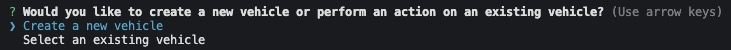
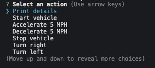

# Vehicle Builder

## Badge


## Description
A fun interative way to engage the user to create cars, trucks, and motobikes. Allow users to choose from a list of options using Inquirer node package.

## Demo Video
https://youtu.be/on1WKZ-fj6U?si=MbjNzU2gPhOMpGpF

## Table of Contents
- [Installation](#installation)
- [Usage](#usage)
- [Credits](#credits)
- [Contributing](#contributing)
- [Acknowledgement](#acknowledgements)
- [License](#license)

## Installation
1. Git clone the repo

2. Install all the necessary node packages
    ```
    npm i
    ```
3. Run the application
    ```
    "npm start" 
    ```
## Usage
You will receive a list of prompts in your terminal asking you questions. 



Create a vehicle, or choose from existing ones. Then you can drive your vehicle, do wheelies, tow other vehicles, accelerate or decelerate



## Credits
- Kenhie

## Contributing
Please continue this project and develop more functionality options or interactions

## Questions
If you have any questions, you can reach me at:

- GitHub: [Kenhie](https://github.com/Kenhie)
- Email: kenhiebusiness@gmail.com

## Acknowledgements
- [Inquirer Package](https://www.npmjs.com/package/inquirer)
- [README Generator](https://github.com/Kenhie94/ReadMeGenerator)

## License
This project is licensed under the [MIT License]().

(Permission is hereby granted, free of charge, to any person obtaining a copy of this software and associated documentation files (the "Software"), to deal in the Software without restriction, including
    without limitation the rights to use, copy, modify, merge, publish, distribute, sublicense, and/or sell copies of the Software, and to permit persons to whom the Software is furnished to do so, subject to the following conditions:

The above copyright notice and this permission notice shall be included in all copies or substantial portions of the Software.

THE SOFTWARE IS PROVIDED "AS IS", WITHOUT WARRANTY OF ANY KIND, EXPRESS OR IMPLIED, INCLUDING BUT NOT LIMITED TO THE WARRANTIES OF MERCHANTABILITY, FITNESS FOR A PARTICULAR PURPOSE AND NONINFRINGEMENT. IN NO EVENT SHALL THE AUTHORS OR COPYRIGHT HOLDERS BE LIABLE FOR ANY CLAIM, DAMAGES OR OTHER LIABILITY, WHETHER IN AN ACTION OF CONTRACT, TORT OR OTHERWISE, ARISING FROM, OUT OF OR IN CONNECTION WITH THE SOFTWARE OR THE USE OR OTHER DEALINGS IN THE SOFTWARE.)

